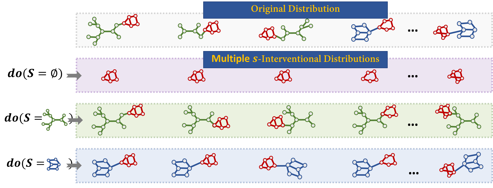
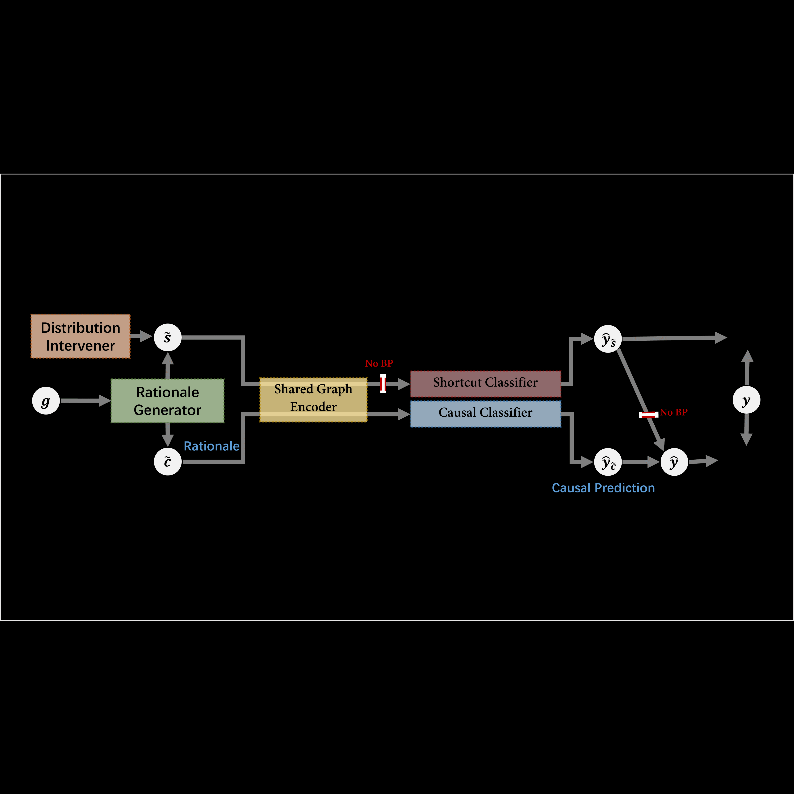
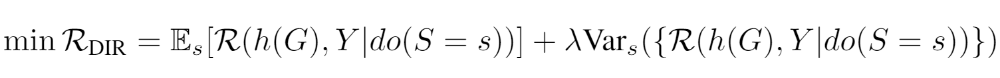

<h1 align="center">
Discovering Invariant Rationales for Graph Neural Networks 🔥
</h1>

<div align="center">

[](https://openreview.net/pdf?id=hGXij5rfiHw)
[](https://github.com/Wuyxin/DIR-GNN) 
[](https://www.youtube.com/watch?v=9d0eXaO_kOw) 
[](https://cs.stanford.edu/~shirwu/slides/dir-iclr22.pdf) 
</div>


## Overview 
**DIR** (ICLR 2022) aims to train intrinsic interpretable Graph Neural Networks that are robust and generalizable to out-of-distribution datasets. The core of this work lies in the construction of interventional distributions, from which causal features are identified. See the **quick lead-in** below.

- **Q: What are interventional distributions?**
  
  They are basically the distributions when we intervene on one variable or a set of variables in the data generation process. For example, we could intervene on the base graph (highlighted in green or blue), which gives us multiple distributions:
    <figure> </figure>
    

- **Q: How to construct the interventional distributions?**    
    We design the following model structure to do the intervention in the representation space, where the distribution intervener is in charge of sampling one subgraph from the non-causal pool and fixing it at one end of the rationale generator.

    <figure> </figure>


- **Q: How can these interventional distributions help us approach the causal features for rationalization?**
    
    Here is the simple philosophy: *No matter what values we assign to the non-causal part, the class label is invariant as long as we observe the causal part*. 
    Intuitively, interventional distributions offer us "multiple eyes" to discover the features that make the label invariant upon interventions. And we propose the DIR objective to achieve this goal
    <figure> </figure>

    See our paper for the formal description and the principle behind it. 


## Installation
- Main packages: PyTorch >= 1.5.0, Pytorch Geometric >= 1.7.0, OGB >= 1.3.0. 
- See `requirements.txt` for other packages.

## Data download
- Spurious-Motif: this dataset can be generated via `spmotif_gen/spmotif.ipynb`. 
- [Graph-SST2](https://github.com/divelab/DIG/tree/main/dig/xgraph/datasets): this dataset can be downloaded [here](https://mailustceducn-my.sharepoint.com/personal/yhy12138_mail_ustc_edu_cn/_layouts/15/onedrive.aspx?id=%2Fpersonal%2Fyhy12138%5Fmail%5Fustc%5Fedu%5Fcn%2FDocuments%2Fpaper%5Fwork%2FGNN%20Explainability%20Survey%2FSurvey%5FText2graph%2FGraph%2DSST2%2Ezip&parent=%2Fpersonal%2Fyhy12138%5Fmail%5Fustc%5Fedu%5Fcn%2FDocuments%2Fpaper%5Fwork%2FGNN%20Explainability%20Survey%2FSurvey%5FText2graph).
- [MNIST-75sp](https://github.com/bknyaz/graph_attention_pool): this dataset can be downloaded [here](https://drive.google.com/drive/folders/1Prc-n9Nr8-5z-xphdRScftKKIxU4Olzh). Download `mnist_75sp_train.pkl`, `mnist_75sp_test.pkl`, and `mnist_75sp_color_noise.pt` to the directory `data/MNISTSP/raw/`.

## Run DIR
The hyper-parameters used to train the intrinsic interpretable models are set as default in the `argparse.ArgumentParser` in the training files. Feel free to change them if needed. We use separate files to train each dataset.

Simply run `python -m train.{dataset}_dir` to reproduce the results in the paper. 

## Common Questions:

How does the Rationale Generator update its parameters?: https://github.com/Wuyxin/DIR-GNN/issues/7

## Reference 
```
@inproceedings{
    wu2022dir,
    title={Discovering Invariant Rationales for Graph Neural Networks},
    author={Ying-Xin Wu and Xiang Wang and An Zhang and Xiangnan He and Tat-seng Chua},
    booktitle={ICLR},
    year={2022},
}
```
