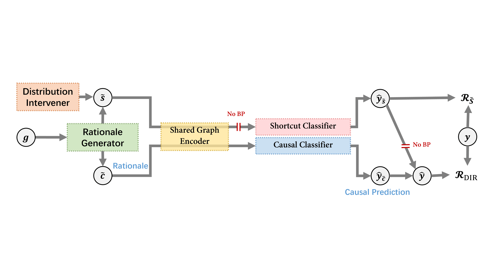

# DIR-GNN
["Discovering Invariant Rationales for Graph Neural Networks"](https://openreview.net/pdf?id=hGXij5rfiHw) (ICLR 2022) aims to train intrinsic interpretable Graph Neural Networks that are generalizable to out-of-distribution datasets. The core of this work lies in the construction of environments, i.e., interventional distributions, and thus discovering the causal features for rationalization.

<figure> </figure>

## Installation
- Main packages: PyTorch >= 1.5.0, Pytorch Geometric >= 1.7.0, OGB >= 1.3.0. 
- See `requirements.txt` for other packages.

## Data download
- Spurious-Motif: this dataset can be generated via `spmotif_gen/spmotif.ipynb`. 
- [Graph-SST2](https://github.com/divelab/DIG/tree/main/dig/xgraph/datasets): this dataset can be downloaded [here](https://mailustceducn-my.sharepoint.com/personal/yhy12138_mail_ustc_edu_cn/_layouts/15/onedrive.aspx?id=%2Fpersonal%2Fyhy12138%5Fmail%5Fustc%5Fedu%5Fcn%2FDocuments%2Fpaper%5Fwork%2FGNN%20Explainability%20Survey%2FSurvey%5FText2graph%2FGraph%2DSST2%2Ezip&parent=%2Fpersonal%2Fyhy12138%5Fmail%5Fustc%5Fedu%5Fcn%2FDocuments%2Fpaper%5Fwork%2FGNN%20Explainability%20Survey%2FSurvey%5FText2graph).
- [MNIST-75sp](https://github.com/bknyaz/graph_attention_pool): this dataset can be downloaded [here](https://drive.google.com/drive/folders/1Prc-n9Nr8-5z-xphdRScftKKIxU4Olzh). Download `mnist_75sp_train.pkl`, `mnist_75sp_test.pkl`, and `mnist_75sp_noise.pt` to the directory `data/MNISTSP/raw/`.
- [OGBG-Molhiv](https://ogb.stanford.edu/docs/graphprop/#ogbg-mol): this dataset will be downloaded automatically.


## Run DIR
The hyper-parameters used to train the intrinsic interpretable models are set as default in the `argparse.ArgumentParser` in the training files. Feel free to change them if needed. We use separate files to train each dataset as the graph convolutional layers of the rationale generators are different.

Simply run `python spmotif_dir.py` to reproduce the results in the paper. 

(TODO)

## Reference 
```
@inproceedings{
shirley2022dir,
title={Discovering Invariant Rationales for Graph Neural Networks},
author={Ying-Xin Wu and Xiang Wang and An Zhang and Xiangnan He and Tat-seng Chua},
booktitle={ICLR},
year={2022},
}
```